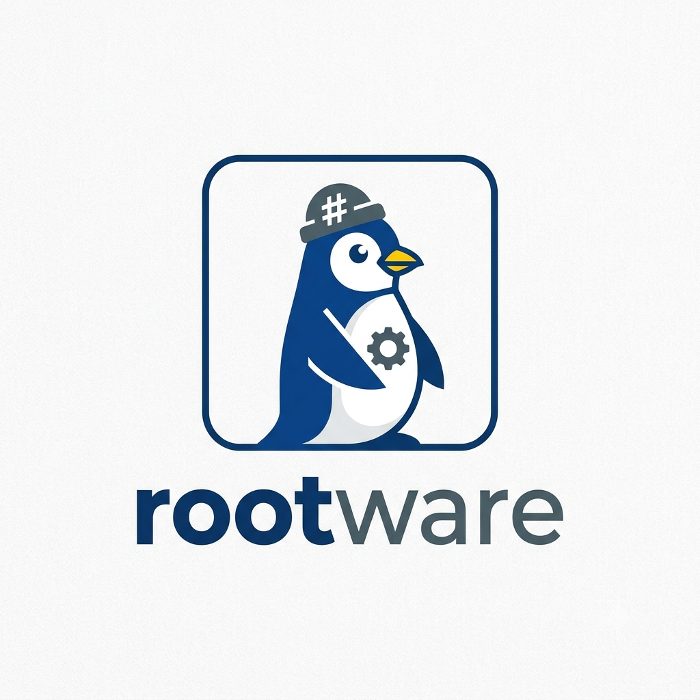

<div align="center">



# Rootware Engine  
**Automated Privilege Escalation Testing Toolkit for Linux**  
*Developed & Maintained by [Sin7](https://t.me/tebub) | [@tebub](https://t.me/tebub)*  

  
  
  

<p align="center">
  <a href="https://rootware.pages.dev">
    
  </a>
</p>

---

</div>

## About

**Rootware** is a curated, terminal-native toolkit engineered for local privilege escalation (LPE) testing on Linux systems. Designed for security professionals and penetration testers, it automatically enumerates system vulnerabilities and executes tailored exploit chains within a controlled environment. 

The engine dynamically downloads and executes exploit payloads in isolated temporary workspaces, ensuring absolute post-test volatility by cleaning up all artifacts after each attempt.

---

## Core Features

* **🧩 Automated LPE Chain:** Evaluates and runs multiple exploit vectors sequentially until root-level access is successfully verified.
* **⚡ Lightweight & Fast:** Delivered as a single standalone binary with zero local external dependencies. Runs directly out of the box.
* **🔐 License Management:** Features a secure, time-based license enforcement scheme with validation tracking via remote API.
* **📊 System Intelligence:** Performs real-time profiling of target kernel versions, underlying CPU architectures, and environmental user contexts.

---

## Usage & Installation

Rootware is distributed in two builds depending on your target system's environment compatibility:

### Option 1: Standalone Package (Recommended for Maximum Compatibility)
If the single binary experiences compatibility or library issues on older/specific Linux distributions, use the standalone package which bundles all required modules:

```bash
# Download the standalone ZIP package
curl -L -o https://rootware.pages.dev/rootware-linux-amd64.zip
unzip rootware-linux-amd64.zip
cd main.dist

# Run Rootware
./rootware
```

### Option 2: One-File Binary (Lightweight)
A single pre-compiled binary build. Fast and straightforward, but may have environment limitations on certain Linux flavors:

```bash
# Download the single binary
curl -L -o rootware https://rootware.pages.dev/rootware
chmod +x rootware

# Run Rootware
./rootware
```

---

## Execution

When prompted after running the engine, enter your active license key obtained from the Telegram bot:

```text
$ ./rootware
❯ Enter license key: ROOTWAREFREE
✓ License validated. Expires: 31-12-2026
✓ Found 12 exploit methods

❯ Select execution vector [1-5]: 1
```

---

## Curated Exploit Methods

Rootware interacts with an updated repository of target techniques managed dynamically without binary code compilation requirements:

* `copyfail` — Page cache corruption via AF_ALG (**CVE-2026-31431**)
* `dirtyfrag` — ESP/XFRM page cache write (**CVE-2026-43284**)
* `pack2theroot` — PackageKit TOCTOU LPE (**CVE-2026-41651**)
* `gttobins` — GTFO Bins secondary privilege escalation vectors
* `kernel` — Dynamic kernel array vulnerability targets
* `sudo` / `docker` — Configuration abuse and container breakout escapes

---

## Licensing Format

Keys follow a strict string structure mapping specific expiration limits, provisioned through the official gateway bot:

```text
# Key Input Protocol: KEY DD-MM-YYYY
ROOTWAREFREE 31-12-2026
SIN7ROOT 30-06-2026
```

---

## Security Architecture

* **Zero Persistent Changes:** Runtime workspaces are systematically scrubbed and components unlinked immediately following active pipeline termination.
* **Transparent Testing:** Execution streams log directly to standard output for step-by-step audit control.
* **User-Space Safety:** Avoids unmanaged local state alterations or kernel module injections.

---

## Contact & Gateway

* **Telegram Bot:** [@rootwbot](https://t.me/rootwbot)  
* **Lead Developer:** [@tebub](https://t.me/tebub) (Sin7)  
* **Secure Delivery:** rootware@proton.me  

---

<div align="center">
Rootware v3.1  
© 2026 Sin7 | All rights reserved.
</div>

